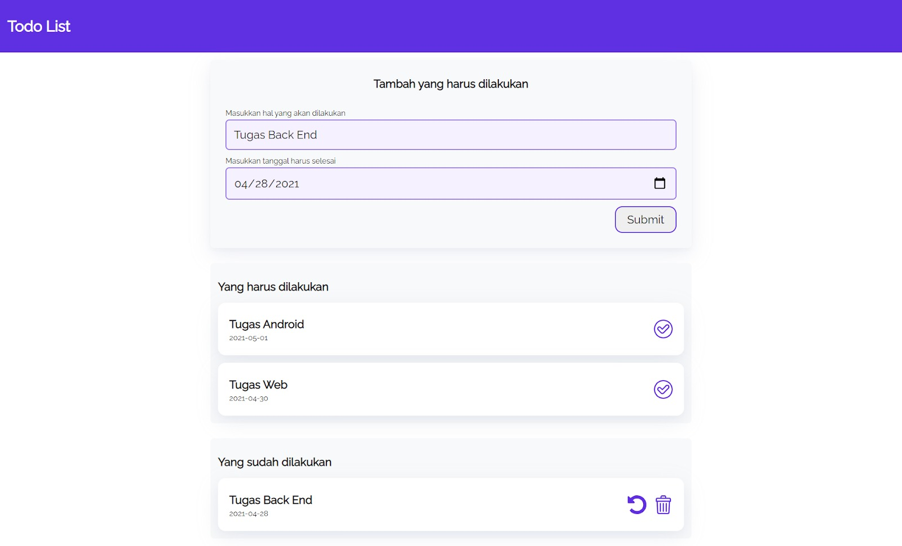

# Membuat Aplikasi Todo Apps

>Sebelumnya Anda telah belajar bagaimana cara membuat elemen menggunakan JavaScript. Nah, kali ini kita akan  membuat sebuah website TODO Apps memanfaatkan penggunaan DOM sehingga website yang kita buat akan tampil dengan dinamis. Kurang lebih tampilan aplikasi yang akan kita buat seperti ini.

- Javascript II (Week 1 Day 3)

Website ini memiliki beberapa fitur, di antaranya adalah membuat, menyelesaikan, dan menghapus todo. Selain itu terdapat fitur untuk membatalkan todo yang sudah selesai atau biasa disebut dengan undo todo. Kita akan membuat satu per satu fitur pada website ini dengan cara membaginya menjadi 3 bagian, yakni:

### Membuat bagian untuk memasukkan todo
- Kita akan membuat bagian awal yang berisi header dan form, keduanya berfungsi untuk memasukkan todo. Setelah Anda mengisi todo pada form, maka todo akan muncul pada console browser.

### Menampilkan todo pada website dan menandai todo telah selesai
- Pada langkah ini Anda akan membuat sebuah bagian untuk menampung todo list yang harus dilakukan. Todo list ini didapat dari form inputan yang dibuat pada langkah pertama. Ketika tombol checklist pada todo ditekan, todo akan ditandai sebagai selesai dan dihapus.

### Menampilkan todo yang telah selesai, menghapus todo, dan mengembalikan todo
- Pada langkah terakhir, Anda akan membuat sebuah bagian untuk menampung todo yang telah selesai. Ketika tombol tempat sampah ditekan, todo akan dihapus. Lalu ketika tombol undo ditekan, todo akan kembali ke bagian todo yang belum selesai.